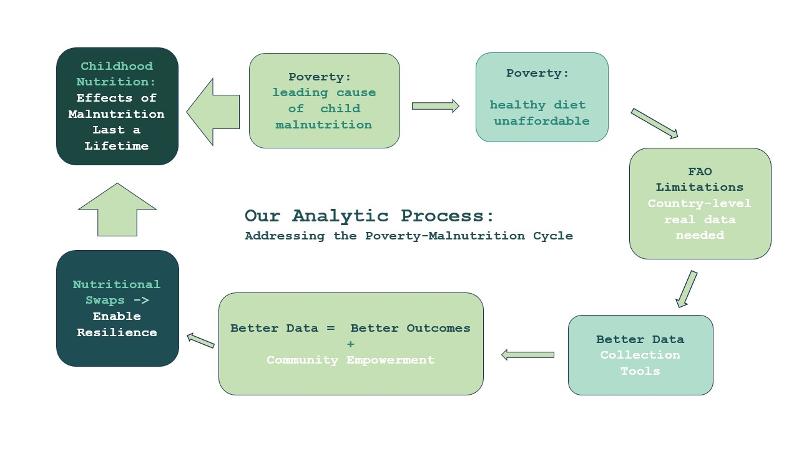

# Women in Data Datathon 2026

## Exploration

Gina - My starting direction was healthy diet affordability across countries, using a nutrition and economic lens.
I was also going to explore the nutrition trade-off question -
  Where is sufficient food energy available but diet quality or micronutrient adequacy still weak?

Lastly, I thought we would all come up with a 3rd question to look at once we saw where the data led us.

Virginia - I began by looking at childhood malnutrition and its lifelong consequences, which traced back to poverty as a leading driver. That pointed to a data gap: FAO and other UN bodies have flagged real-time, subnational retail food price data as necessary for tracking healthy diet affordability, but it's largely unavailable at the country level. My work became building a pipeline to collect that data directly and turn corrections into training data for it — see the [pipeline folder](https://github.com/gmancuso82/women-in-data-2026-datathon/blob/main/data-collection-pipeline/README.md) for details.

## Our analytic process

The project follows one feedback loop: childhood malnutrition and poverty reinforce each other, and the data needed to break that cycle is exactly the data that's hardest to get.

1. **Childhood malnutrition ↔ poverty** — malnutrition's effects on a child last a lifetime, and poverty is a leading driver of it.
2. **Poverty → unaffordable diets** — poverty is why a nutritionally adequate diet is out of reach.
3. **→ FAO data limitations** — the country-level, real-time price data needed to track this is largely unavailable.
4. **→ better data collection tools** — this project's pipeline addresses that gap directly.
5. **→ better data = better outcomes + community empowerment** — locally-run collection builds capacity, not just numbers.
6. **→ nutritional swaps enable resilience** — better data supports low-cost substitutions that help households absorb price shocks.
7. **→ back to childhood nutrition** — closing the loop.

## Project structure

- `data/raw/` — original downloaded data; do not modify it.
- `data/processed/` — cleaned, analysis-ready data.
- `notebooks/` — exploration and analysis notebooks.
- `src/` — reusable analysis code.
- `outputs/` — charts and presentation-ready results.
- `notes/` — research questions, decisions, and source notes.
